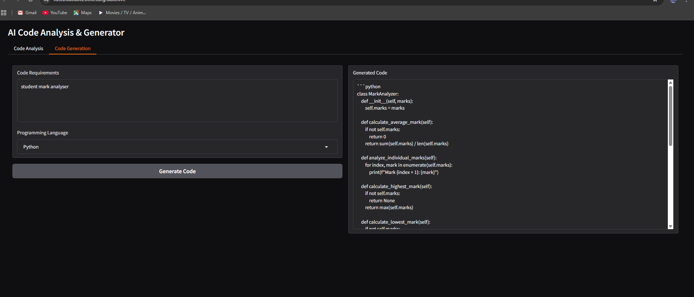

# SmartSDLC-IBM-Project

## 📝 Overview  
This project demonstrates the **Smart Software Development Life Cycle (SmartSDLC)** model under the Naan Mudhalvan / IBM SkillsBuild program.  
It focuses on applying AI tools and structured analysis to make software development smarter, faster, and more reliable.  

## 🚀 Features  
- Organized SDLC process with AI-powered assistance  
- Requirement analysis & simple automation examples  
- Clear project documentation and demo walkthrough  
- Easy-to-run Python scripts for testing and learning  

## 📁 Repository Structure  
- **/code** → Python files for analysis and demo  
- **/docs** → Supporting project materials  
- **README.md** → Project summary and usage guide

## Health AI Output


## 🎬 Project Walkthrough  
A short demo video is available here:  
👉 [Click to Watch Demo]()  

This video highlights:  
1. Introduction to the project  
2. Repository structure & files  
3. README walkthrough  
4. Example output from Google Colab

 ## 👥 Team leader
 -Sanjay V

## 👥 Team Members
- Sathish.AS
- Tamilselvan.S
- Abinash.V

## ⚡ How to Run  
1. Clone the repository:  
   ```bash
   git clone https://github.com/venkattweb/SmartSDLC-IBM-Project.git
